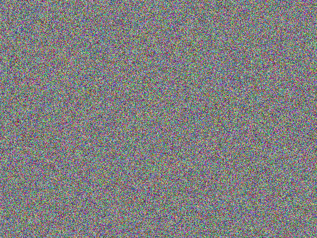
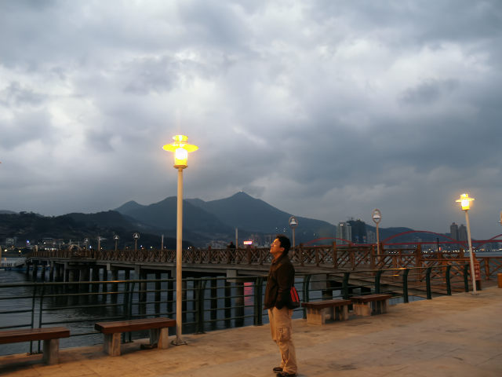

# LLDE: Enhancing Low-light Images With Diffusion Model

### Official pytorch implementation of the paper: 
#### - LLDE: Enhancing Low-light Images With Diffusion Model

[Paper](assets/ICIP2023_LLDE.pdf) | [Bibtex](#citation) | [Poster](assets/ICIP2023_LLDEp.pdf)

(Released on June 28, 2023)

## Results
<table border="0" cellspacing="0" cellpadding="0">
  <tr>
    <td align="center"><b>Input Image</td>
    <td align="center"><b> Enhancement Process</td>
    <td align="center"><b>Output Image</td>
  <tr>
    <td> </td>
    <td> </td>
    <td> </td>
  </tr>
</table>

## Datasets
- We use LOL dataset as training data, which is available in [RetinexNet repo](https://github.com/weichen582/RetinexNet)
- We use LSRW dataset as testing data, which is available in [R2RNet repo](https://github.com/JianghaiSCU/R2RNet)

## How to run

### Requirements
1. python 3.10
2. pytorch == 1.11.0  
3. accelerate == 0.12.0
4. wandb == 0.12.17 (used in model training)

### Pre-trained model
Download the [pretrained model](https://drive.google.com/file/d/1LDhgrZuUtB8dm5ozB-tCdk3FhLIx-W49/view?usp=sharing) and put it into `./checkpoints`

### Training
- Download your training dataset
- Execute `train.py` (refer `train.py` to check what parameters/hyperparameters to run with)
  ```bash
  python train.py --dataset_dir=path/to/your/training/dataset --batch_size=32
  ```
### Testing
- Download your testing dataset
- Put your model weight into `./checkpoints`
- Execute `test.py` (refer `test.py` to check what parameters/hyperparameters to run with)
  ```bash
  python test.py --dataset_dir=path/to/your/testing/dataset --model_name=LLDE --timestep_respacing=25
  ```

- The output images are saved in `./saved_images` by default

## Citation
If you find this work useful for your research, please cite
```bibtex
@article{LLDE,
  inproceedings={LLDE: Enhancing Low-light Images With Diffusion Model},
  author={Ooi, Xin Peng and Chan, Chee Seng},
  booktitle={2023 IEEE international conference on image processing (ICIP)},
  year={2023}
}
```

## Feedback
Suggestions and opinions on this work (both positive and negative) are greatly welcomed. Please contact the authors by sending an email to
`0417oxp at gmail.com` or `cs.chan at um.edu.my`.

## License and Copyright
The project is open source under BSD-3 license (see the ``` LICENSE ``` file).

&#169;2023 Universiti Malaya.
